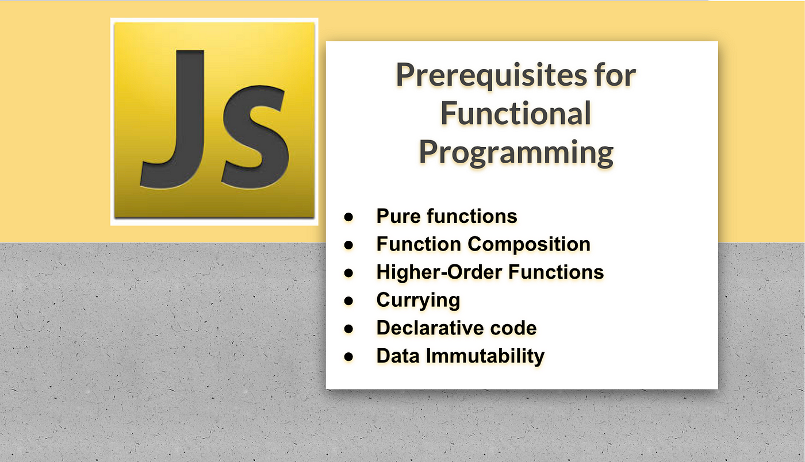

# 🙉 Functional Programming in Javascript.
Functional Programming(FP) is as old as programming but some of us think that it is discovered recently because we found some parts in mathematics but not in the programming world. But nowadays functional programming is in trend. Almost every programming language including Java, Python, JavaScript, etc. is adopting functional programming.

# 1. 🤖  What is Functional Programming (FP) 

In computer science, functional programming is a programming paradigm—a style of building the structure and elements of computer programs—that treats computation as the evaluation of mathematical functions and avoids changing-state and mutable data. It is a declarative programming paradigm in that programming is done with expressions or declarations instead of statements. In functional code, the output value of a function depends only on its arguments, so calling a function with the same value for an argument always produces the same result. This is in contrast to imperative programming where, in addition to a function's arguments, global program state can affect a function's resulting value. Eliminating side effects, that is, changes in state that do not depend on the function inputs, can make understanding a program easier, which is one of the key motivations for the development of functional programming.

## 🤡 1. forEach() method executes a provided function once for each element in an array, in ascending index order.

We use forEach when we like to iterate through an array of items. The forEach is a higher-order function and it takes call-back as a parameter. The forEach method is used only with array and we use forEach if you are interested in each item or index or both.

```js
// syntax in a normal or a function declaration

function callback(item, index, arr) {}
array.forEach(callback)

// or syntax in an arrow function
const callback = (item, i, arr) => {}
array.forEach(callback) 
```

The call back function could be a function declaration or an arrow function.

Let see different examples

```js
const countries = ['Germany', 'America', 'Russia', 'France']
countries.forEach(function(country, index, arr) {
  console.log(i, country.toUpperCase())
})
```

If there is no much code inside the code block we can use an arrow function and we can write it without a curly bracket. The index and the array parameters are optional, we can omit them.

```js
const countries = ['Germany', 'America', 'Russia', 'France']
countries.forEach((country, i) => console.log(i, country.toUpperCase()))
```

```sh
0 "Germany"
1 "America"
2 "Russia"
3 "France"
```

For example if we like to change each country to uppercase and store it back to an array we write it as follows.

```js
const countries = ['Germany', 'America', 'Russia', 'France']
const newCountries = []
countries.forEach(country => newCountries.push(country))

console.log(newCountries) // ["Germany", "America", "Russia", "France"]
```

Let us see more examples. For instance if we want to sum an array of numbers we can use forEach or reduce. Let us see how we use forEach to sum all numbers in an array.

```js
const numbers = [1, 2, 3, 4, 5]
let sum = 0
numbers.forEach((n) => sum += n)

console.log(sum) // 15
```

Let us move to the next functional programming method which is going to be a map.


## 2. map In JavaScript, a Map is a built-in object that stores key-value pairs, similar to a dictionary in other programming languages. However, unlike objects where keys are implicitly strings, Map allows keys of any data type, including objects and functions. Map objects maintain the insertion order of elements.

We use the map method whenever we like to modify an array. We use the map method only with arrays and it always returns an array.

```js
// syntax in a normal or a function declaration

function callback(item, i) {
return // code goes here
}

const modifiedArray = array.map(callback)

// or syntax in an arrow function

const callback = (item, i) => {
return // code goes here
}
const modifiedArray = array.map(callback)
```

Now, let us modify the countries array using the map method. The index is an optional parameter

```js
// Using function declaration

const countries = ['Germany', 'America', 'Russia', 'France']

const newCountries = countries.map(function(country) {
return country.toUpperCase()
})

console.log(newCountries)

// map using an arrow function call back

const countries = ['Germany', 'America', 'Russia', 'France']
const newCountries = countries.map(country => country.toUpperCase())

console.log(newCountries) 

```

As you can see that map is very handy to modify an array and to get an array back. Now, let us create an array of the length of the countries from the countries array.

```js
const countries = ['Germany', 'America', 'Russia', 'France']
const countriesLength = countries.map(country => country.length)

console.log(countriesLength) // [7, 7, 6, 6]
```

Let us see another more example

```js
const numbers = [1, 2, 3, 4, 5]
const squares = numbers.map(n => n ** 2)

console.log(squares) // [1, 4, 9, 16, 25]
```


